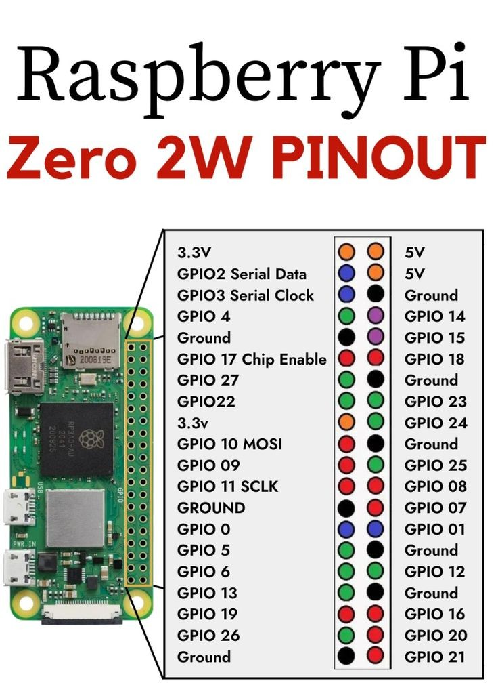

### Overview
This package is meant to be the second iteration of the door button presser for my front door.

This package should create a website that when given a password will active the servo attached to a raspberry pi.

### Install Git
```
sudo apt-get install git
```

### Clone repo:
```
git clone https://github.com/Unshure/DoorButtonPresserWebsite2.0.git ./doorbuttonpresser
```


### Setup script
```
sudo apt update && sudo apt upgrade
sudo apt remove nodejs npm -y
curl -o- https://raw.githubusercontent.com/nvm-sh/nvm/v0.39.2/install.sh | bash
echo "export NVM_NODEJS_ORG_MIRROR=https://unofficial-builds.nodejs.org/download/release" >> ~/.bashrc
source ~/.bashrc
nvm install --lts
nvm use --lts
node -v
npm -v
```

### Install Dependencies 
```
cd ./doorbuttonpresserserver
npm install
npm run build

cd ..
```

### Setup nginx
```
sudo apt install nginx certbot python3-certbot-nginx -y
```

### Copy nginx config into: `/etc/nginx/sites-available/doorbuttonpresser.com`
```
server {
    listen 80;
    server_name unshure.duckdns.org;

    root /home/nick/doorbuttonpresser/doorbuttonpresserwebsite/build;
    index index.html index.htm;

    # React app routing
    location / {
        try_files $uri /index.html;
    }

    # Proxy API to backend on port 4000
    location /open-door {
        proxy_pass http://localhost:4000;
        proxy_http_version 1.1;
        proxy_set_header Upgrade $http_upgrade;
        proxy_set_header Connection 'upgrade';
        proxy_set_header Host $host;
        proxy_cache_bypass $http_upgrade;
    }
}
```

### Setup nginx certificates and file permissions
```
sudo ln -s /etc/nginx/sites-available/unshure.duckdns.org /etc/nginx/sites-enabled/
sudo nginx -t
sudo systemctl reload nginx

sudo certbot --nginx -d unshure.duckdns.org

sudo chmod o+X /home/nick
sudo chmod o+X /home/nick/doorbuttonpresser
sudo chmod o+X /home/nick/doorbuttonpresser/doorbuttonpresserwebsite
sudo chmod o+X /home/nick/doorbuttonpresser/doorbuttonpresserwebsite/build
sudo chmod -R o+r /home/nick/doorbuttonpresser/doorbuttonpresserwebsite/build
```

### Update /etc/rc.local to run scripts at startup
```
#!/bin/sh -e

sudo ENABLE_SERVO=TRUE PASSCODE=<PASSWORD> /home/nick/.nvm/versions/node/v22.18.0/bin/node /home/nick/doorbuttonpresser/doorbuttonpresserserver/build/index.js &

exit 0
```
### Setup rc.local:
```
sudo chmod +x /etc/rc.local

sudo systemctl enable rc-local
sudo systemctl start rc-local
sudo systemctl status rc-local
```




